# StressHelp


## Projekti: Terveyssovelluksen kehitys, Metropolia ammattikorkeakoulu
### Ryhmä 8

### Julkaistu Sovellus
- [StressHelp](https://stress-help.northeurope.cloudapp.azure.com/src/pages/)

### Repository-linkit

- Frontend: [Frontend](https://github.com/SHEEPLAND/StressHelp-FE-2025)
- Backend: [Backend](https://github.com/SHEEPLAND/StressHelp-BE-2025)


## Kuvaus

**StressHelp** on verkkopohjainen sovellus, joka tarjoaa työkaluja ja resursseja stressin hallintaan sekä henkisen hyvinvoinnin tukemiseen. Sovellus yhdistää fysiologisen datan (HRV) ja käyttäjän omat tuntemukset visuaaliseen kokonaisuuteen. Käytössä on myös meditaatio-ohjelmia, hyvinvointivinkkejä ja oma päiväkirja.

## Käyttöliittymä

### Kuvakaappaukset sovelluksen käyttöliittymästä


- *Etusivu, josta käyttäjä voi aloittaa itsearvioinnin tai kirjautua sisään.*

<div style="border: 1px solid #ccc; padding: 12px; border-radius: 8px; background-color: #f9f9f9; max-width: 640px; margin-bottom: 1rem;">
  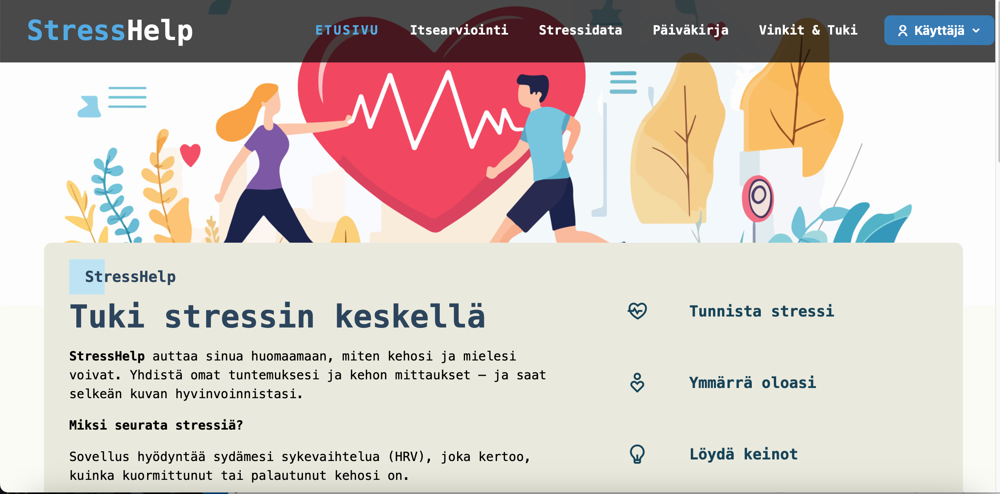

  <p style="text-align: center; font-style: italic; color: #666; margin-top: 8px;">
    Kuva 1: Etusivu
  </p>
</div>


- *Kirjautumissivu, jossa käyttäjä voi kirjautua tai rekisteröityä.*
<div style="border: 1px solid #ccc; padding: 12px; border-radius: 8px; background-color: #f9f9f9; max-width: 640px; margin-bottom: 1rem;">
  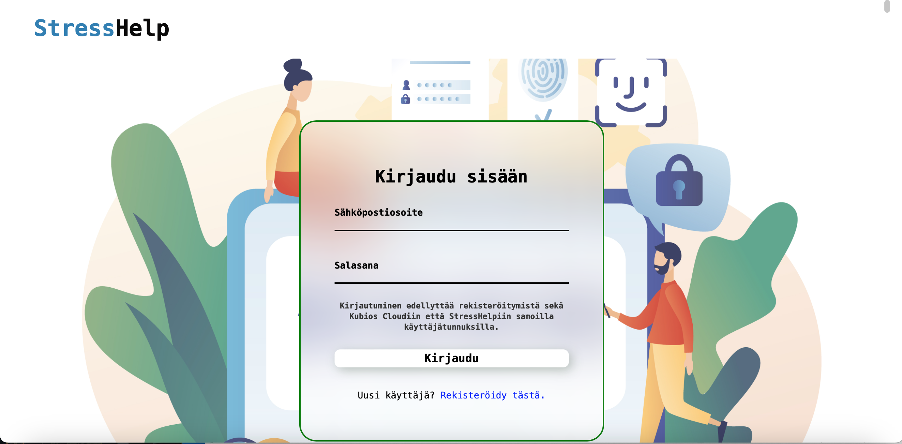

  <p style="text-align: center; font-style: italic; color: #666; margin-top: 8px;">
    Kuva 2: Kirjautumissivu
  </p>
</div>


- *Itsearviointikysely, jossa käyttäjä voi arvioida omaa stressitasoaan.*

<div style="border: 1px solid #ccc; padding: 12px; border-radius: 8px; background-color: #f9f9f9; max-width: 640px; margin-bottom: 1rem;">
  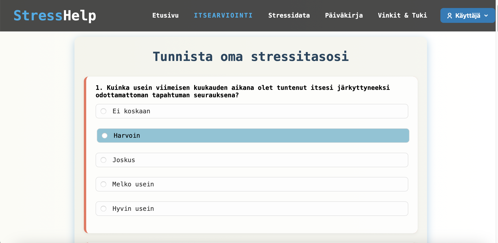

  <p style="text-align: center; font-style: italic; color: #666; margin-top: 8px;">
    Kuva 3: Itsearviointikyselysivu
  </p>
</div>


- *Käyttäjän henkilökohtainen Stressimittaus-osio, jossa käyttäjä voi seurata HRV-data ja mittaushistoriaa.*
<div style="border: 1px solid #ccc; padding: 12px; border-radius: 8px; background-color: #f9f9f9; max-width: 640px; margin-bottom: 1rem;">
  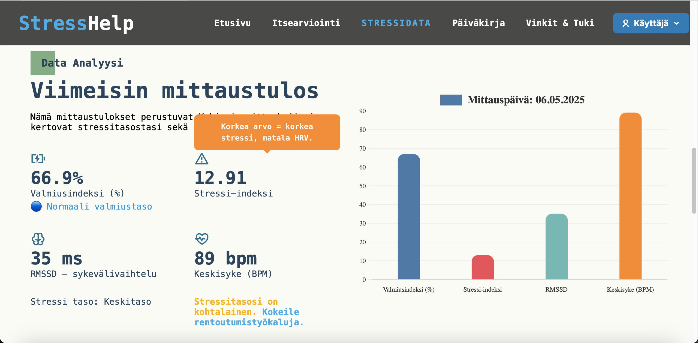

  <p style="text-align: center; font-style: italic; color: #666; margin-top: 8px;">
    Kuva 4: Stressidatasivun viimeisin mittaustulos
  </p>
</div>

<div style="border: 1px solid #ccc; padding: 12px; border-radius: 8px; background-color: #f9f9f9; max-width: 640px; margin-bottom: 1rem;">
  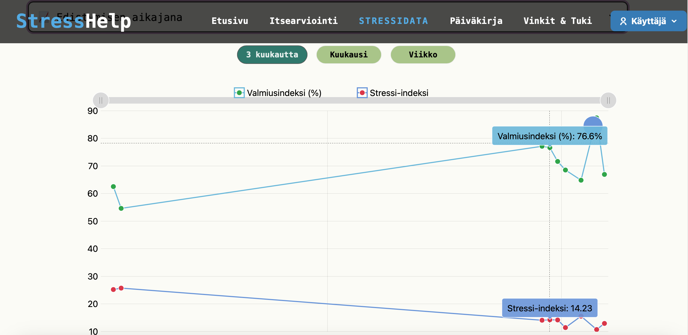

  <p style="text-align: center; font-style: italic; color: #666; margin-top: 8px;">
    Kuva 5: Stressidatasivun mittaushistoria
  </p>
</div>


- *Sovelluksen Päiväkirjasivu, jossa käyttäjä voi luoda päiväkirjamerkintöjä.*
<div style="border: 1px solid #ccc; padding: 12px; border-radius: 8px; background-color: #f9f9f9; max-width: 640px; margin-bottom: 1rem;">
  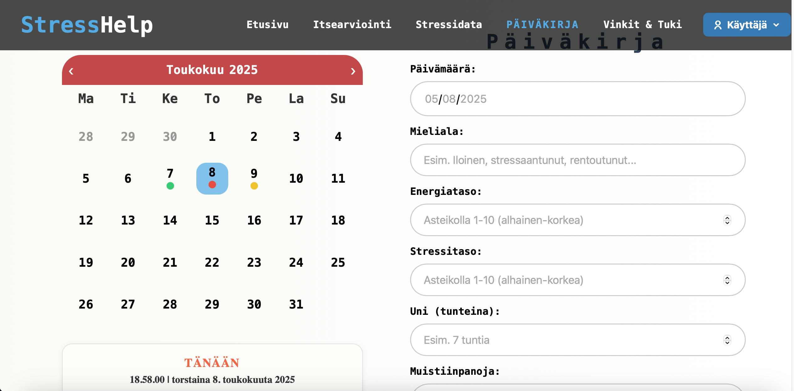

  <p style="text-align: center; font-style: italic; color: #666; margin-top: 8px;">
    Kuva 6: Päiväkirjasivu
  </p>
</div>

<div style="border: 1px solid #ccc; padding: 12px; border-radius: 8px; background-color: #f9f9f9; max-width: 640px; margin-bottom: 1rem;">
  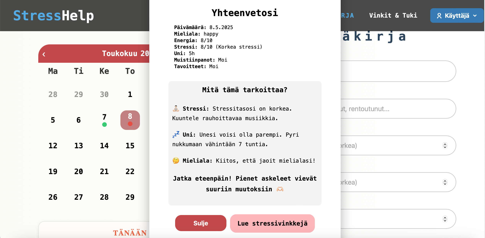

  <p style="text-align: center; font-style: italic; color: #666; margin-top: 8px;">
    Kuva 7: Päiväkirjasivu yhteenveto
  </p>
</div>


- *Sovelluksen Vinkit & tukisivu, jossa käyttäjä voi tutustua eri stressihallinta keinoihin.

<div style="border: 1px solid #ccc; padding: 12px; border-radius: 8px; background-color: #f9f9f9; max-width: 640px; margin-bottom: 1rem;">
  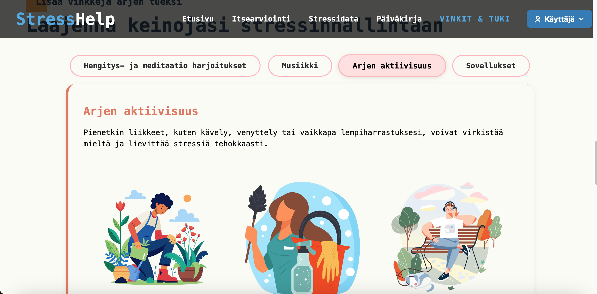

  <p style="text-align: center; font-style: italic; color: #666; margin-top: 8px;">
    Kuva 6: Vinkit & Tuki
  </p>
</div>


- Sovelluksen Omat tiedotsivu, jossa käyttäjä voi tarkastella omia tietojaan.
<div style="border: 1px solid #ccc; padding: 12px; border-radius: 8px; background-color: #f9f9f9; max-width: 640px; margin-bottom: 1rem;">
  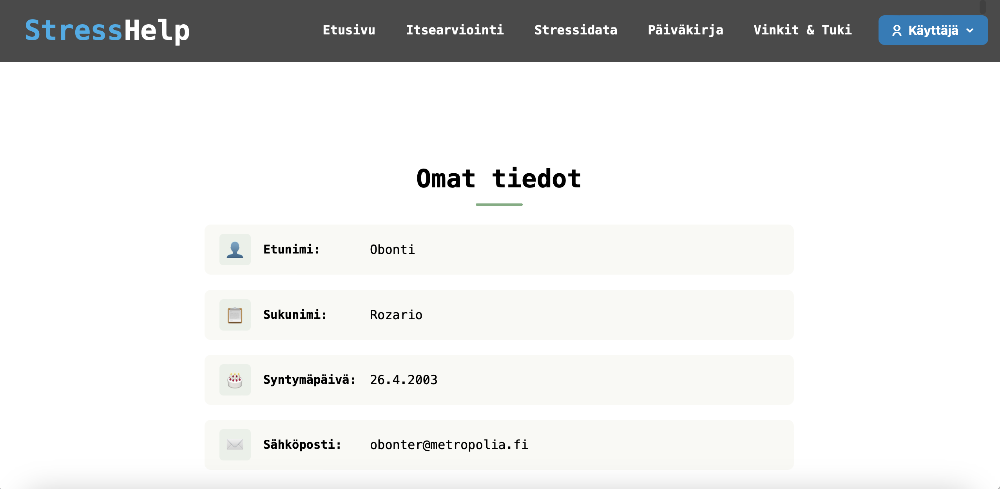

  <p style="text-align: center; font-style: italic; color: #666; margin-top: 8px;">
    Kuva 7: Omat Tiedot
  </p>
</div>


## Toiminnallisuudet

### Toteutetut toiminnallisuudet

- Kirjautuminen ja rekisteröinti
- Kubios-tokenin syöttäminen ja HRV-datan tuonti
- HRV-historian kaaviot ja taulukot
- Itsearviointikysely ilman kirjautumista
- Päiväkirjamerkintöjen luonti, muokkaus ja poisto
- Vinkit & apu stressinhallintaan 
- Responsiivinen käyttöliittymä


## Api Routes

### POST /api/auth/login – Kirjautuminen

- Kirjaudu käyttäjänä

```json

POST http://localhost:3000/api/auth/login
Content-Type: application/json

{
  "username": "kubios sähköposti",
  "password": "kubios salasana"
}
```

### GET /api/kubios-data/user-data

- Hae oma kubios data (Vaatii Tokenin)

```json
GET http://localhost:3000/api/kubios-data/user-data
Authorization: Bearer
```

### GET /api/kubios-data/user-info

- Hae omat kubios käyttäjä tiedot (Vaatii Tokenin)

```json
GET http://localhost:3000/api/kubios-data/user-info
Authorization: Bearer
```

### GET /api/entries

- Hae omat päiväkirjamerkinnät (Vaatii Tokenin)
```json
GET http://localhost:3000/api/entries
Authorization: Bearer
```

### POST /api/entries

- Lisää päiväkirja merkintä (Vaatii Tokenin)

```json
POST http://localhost:3000/api/entries
Authorization: Bearer 
{
 "entry_date": "2025-05-08",
 "mood": "Sad",
 "energy_level": 8,
 "stress_level": 3,
 "sleep_hours": 8,
 "notes": "I had a bad day!",
 "goals": "Save the world!" 
} 
```


### DELETE /api/entries/:id

- Poista päiväkirja merkintä (Vaatii Tokenin)

``` json
DELETE http://localhost:3000/api/entries/22
Authorization: Bearer
```

### PUT /api/entries/21

- Muokkaa olemassaolevaa päiväkirja merkintää (Vaatii Tokenin)

```json
PUT http://localhost:3000/api/entries/21
Authorization: Bearer 
content-type: application/json
```


## Käytetyt teknologiat ja työkalut

- **Frontend**: HTML, CSS, JavaScript (Vanilla)
- **Backend**: *Node.js + Express.js, Cors, JWT, Bcrypt.js*
- **Tietokanta**: *MariaDB*
- **Hosting**: Microsoft Azure (northeurope.cloudapp.azure.com)

## Tietokantarakenne

### Tietokantataulut ja niiden suhteet
- **Users**: Käyttäjien tiedot (*user_id, username, password, email, created_at*)
- **DiaryEntries**: Käyttäjien päiväkirjamerkinnät (*entry_id, user_id, entry_date, mood, energy_level, stress_level, sleep_hours, notes, goals, created_at*)


<div style="border: 1px solid #ccc; padding: 12px; border-radius: 8px; background-color: #f9f9f9; max-width: 640px; margin-bottom: 1rem;">
  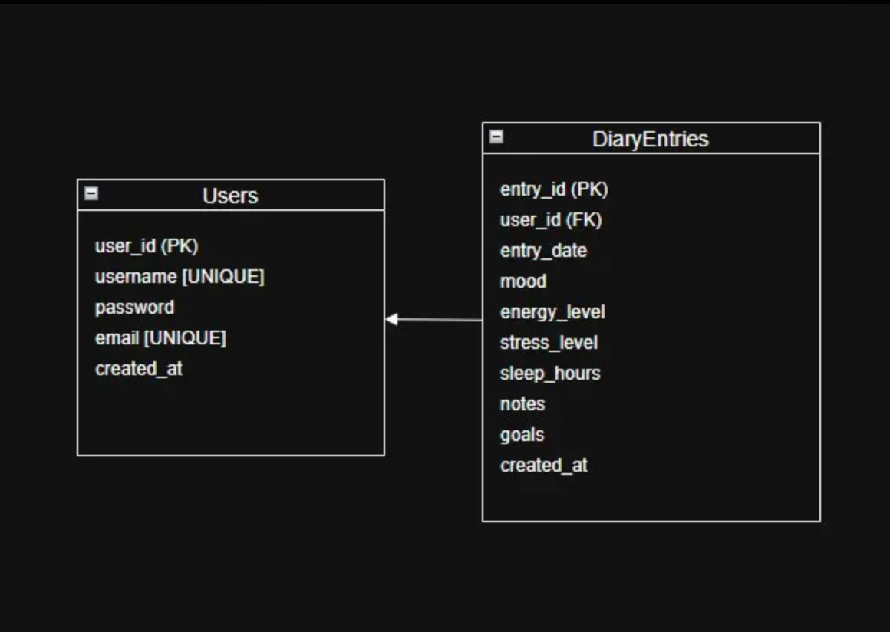

  <p style="text-align: center; font-style: italic; color: #666; margin-top: 8px;">
    Kuva 10: Tietokantarakenne
  </p>
</div>


### Rautalankamallit

<div style="border: 1px solid #ccc; padding: 12px; border-radius: 8px; background-color: #f9f9f9; max-width: 640px; margin-bottom: 1rem;">
  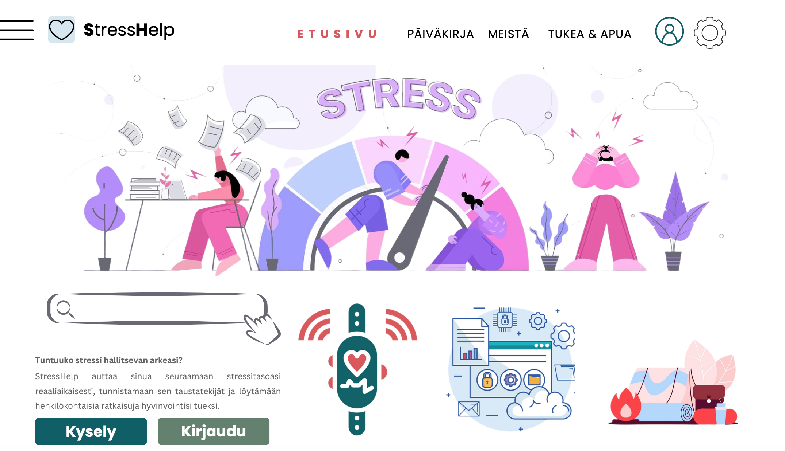
  <p style="text-align: center; font-style: italic; color: #666; margin-top: 8px;">
    Kuva 11: Rautalankamalli
  </p>
</div>

<div style="border: 1px solid #ccc; padding: 12px; border-radius: 8px; background-color: #f9f9f9; max-width: 640px; margin-bottom: 1rem;">
  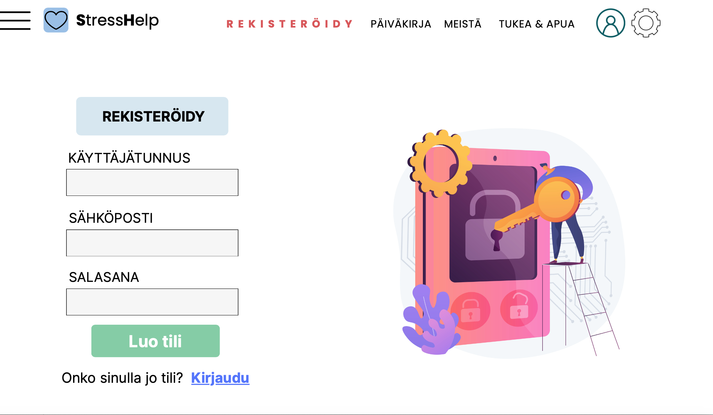

  <p style="text-align: center; font-style: italic; color: #666; margin-top: 8px;">
    Kuva 12: Rautalankamalli
  </p>
</div>

<div style="border: 1px solid #ccc; padding: 12px; border-radius: 8px; background-color: #f9f9f9; max-width: 640px; margin-bottom: 1rem;">
  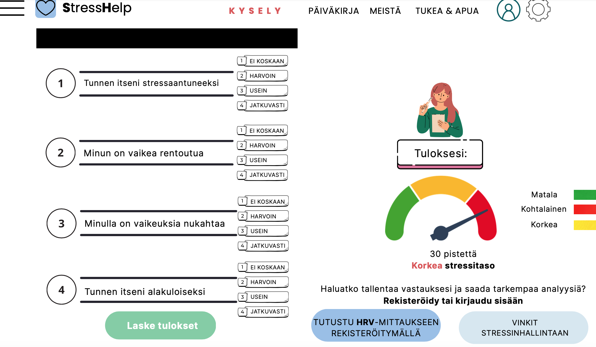

  <p style="text-align: center; font-style: italic; color: #666; margin-top: 8px;">
    Kuva 13: Rautalankamalli
  </p>
</div>

## Testaus kansio ja Github.io

- [Linkki ohjelmistotestauskansioon](https://github.com/SHEEPLAND/StressHelp-FE-2025/tree/tests)
- [Linkki Github.io ohjelmistotestaus sivuun](https://sheepland.github.io/StressHelp-FE-2025/)


## Tiedossa olevat bugit ja ongelmat

- *Ei tiedossa olevia*


## Referenssit ja käytetyt kirjastot

- **Swiper.js** – responsiivinen karuselli 
- **RemixIcon** – ikonikirjasto käyttöliittymään
- **Chart.js** – yksinkertainen kaaviokirjasto 
- **amCharts 5** – interaktiiviset kaaviot ja visualisoinnit
- **ScrollReveal** – animaatiot scrollatessa 


### Käyttö

1. Avaa sovellus selaimessa: [https://stress-help.northeurope.cloudapp.azure.com/src/pages/](https://stress-help.northeurope.cloudapp.azure.com/src/pages/)
2. Rekisteröidy luomalla käyttäjätili kubioksessa tai kirjaudu olemassa olevilla tunnuksilla
3. Navigoi sovelluksessa ylävalikon kautta:

   - Etusivulta löydät yleistä tietoa sovelluksesta sekä aloitusoppaan sovelluksen käyttöön.
   - Itsearviointi sivulta löydät stressitason itsearviointikyselyn.
   - Stressidata sivulta löydät ohjeet mitaukseen, viimeisimmät mittaukset ja kaaviot mittaushistoriasta.
   - Päiväkirja sivulta löydät lomakkeen päiväkirjamerkintöjen tekemiseen ja kalenterin jolla voit tarkastella, poistaa ja muokata merkintöjä.
   - Vinkit ja tuki sivulta löydät stressinhallintaan erinlaisia harjoituksia ja vinkkejä sekä terveydenhuollon ammattilaisten yhteystietoja.
   - Omat tiedot sivulta löydät käyttäjätietosi. 